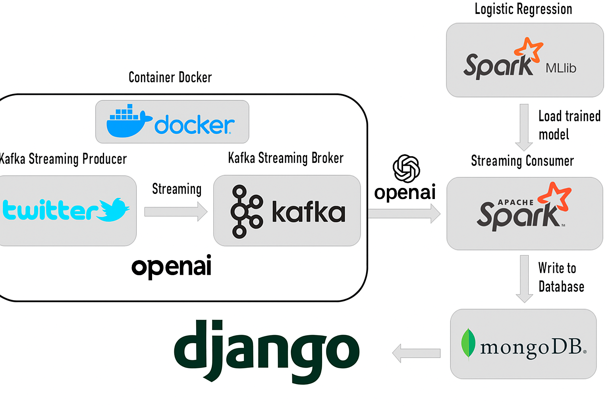
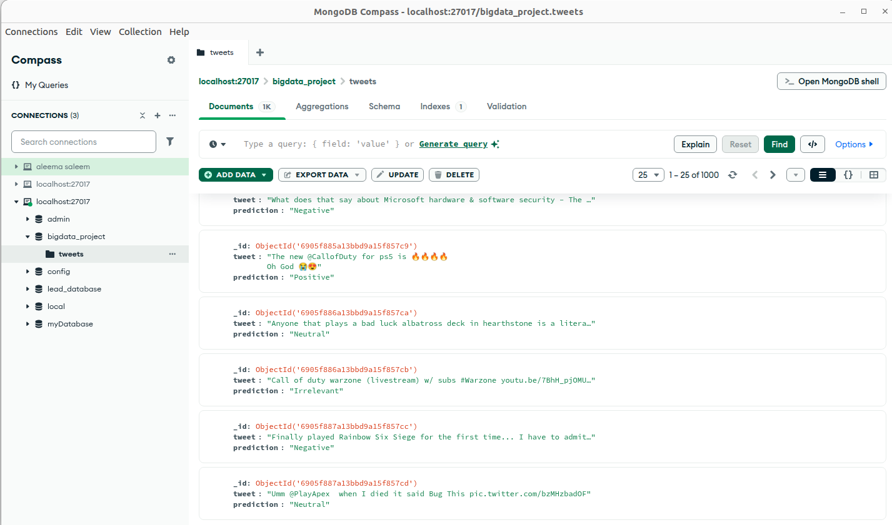
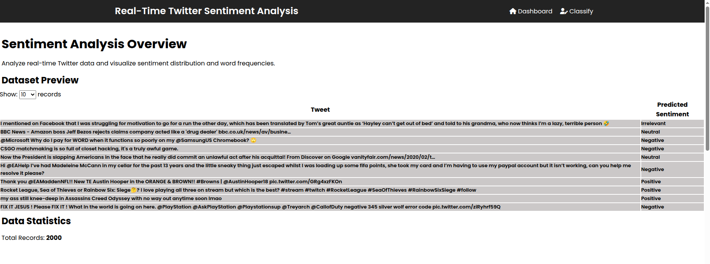
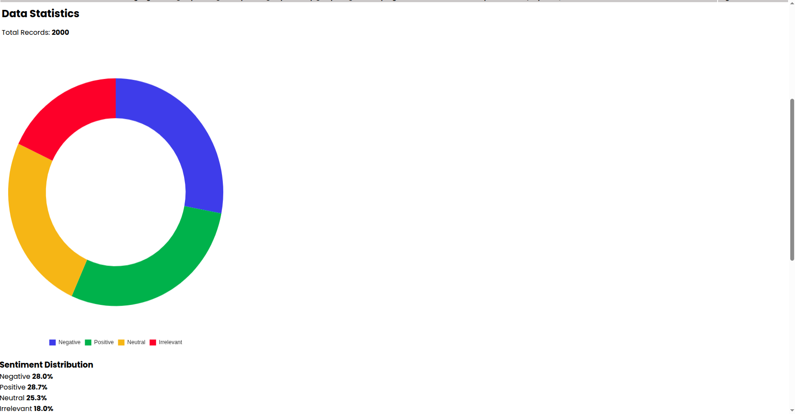
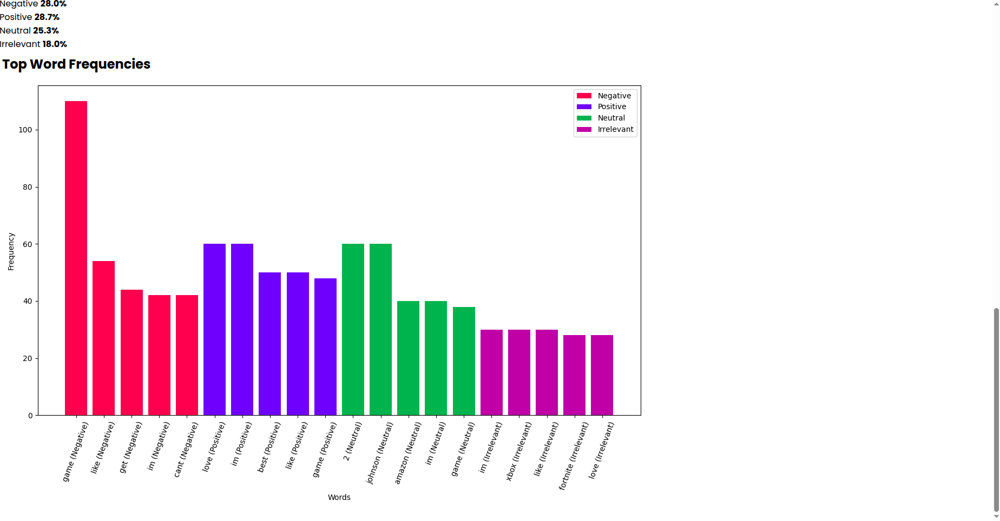
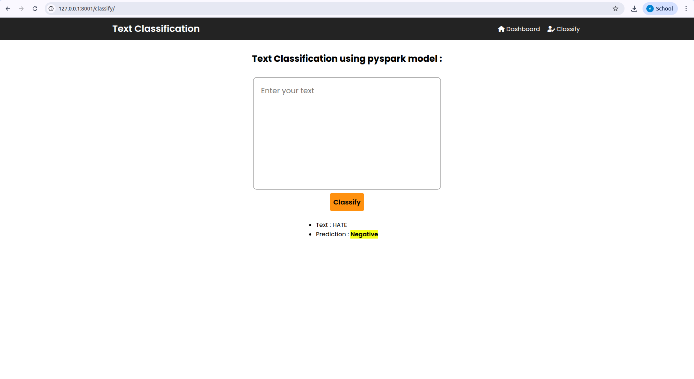

# Big Data Project: Real-Time Twitter Sentiment Analysis Using Kafka, Spark (MLlib & Streaming), MongoDB, and Django

## Overview

This repository contains a Big Data project focused on **real-time sentiment analysis of Twitter data**. The system classifies tweets into **Positive, Negative,Irrelevant or Neutral** categories using a combination of streaming, machine learning, and web technologies. It provides a live dashboard for visualization and stores results for further analysis.

## Project Architecture

The project integrates the following components:

* **Apache Kafka**: Real-time data ingestion from Twitter datasets.
* **Spark Streaming**: Processes data streams from Kafka to perform sentiment analysis.
* **MongoDB**: Stores processed sentiment data for persistence.
* **Django**: Web framework for building a real-time dashboard to visualize results.
* **Chart.js & Matplotlib**: Used for plotting statistics and visualizations.

Project Flow:



## Features

* **Real-time Data Ingestion**: Streams live tweets using Kafka.
* **Stream Processing**: Processes and analyzes data in real-time with Spark Streaming.
* **Sentiment Analysis**: Classifies tweets using NLP techniques into Positive, Negative, or Neutral.
* **Data Storage**: Saves processed tweets in MongoDB for historical analysis.
* **Visualization**: Provides a live dashboard built with Django for interactive insights.

## Dataset Description

The project uses the following datasets:

* **twitter_training.csv**: 1M+ tweets used to train the PySpark model.
* **twitter_validation.csv**: 1000 tweets used to validate the model.

**Feature Data Types**:

* `Tweet ID` : int
* `Entity` : string
* `Sentiment` : string (Target)
* `Tweet Content` : string

## Repository Structure

* **Django-Dashboard**: Django application for the live dashboard.
* **Kafka-PySpark**: Kafka producer and PySpark streaming (consumer) code.
* **ML PySpark Model**: Trained model, datasets, and Jupyter notebooks.
* **zk-single-kafka-single.yml**: Docker configuration to set up Kafka.
* **bigdataproject rapport**: Project report (in French).

## Getting Started

### Prerequisites

* Docker (for Kafka)
* Python 3.x
* Apache Kafka
* Apache Spark (PySpark)
* MongoDB
* Django

### Installation

1. **Clone the repository**:

```bash
git clone https://github.com/AleemaSaleem/Real-Time-Twitter-Sentiment-Analysis.git
cd Real-Time-Twitter-Sentiment-Analysis
```

2. **Install Docker Desktop** (if not installed).

3. **Set up Kafka**:

```bash
docker-compose -f zk-single-kafka-single.yml up -d
```

4. **Set up MongoDB**:

   * Install MongoDB and optionally MongoDB Compass for visualization.

5. **Install Python dependencies**:

```bash
pip install -r requirements.txt
```

---

## Running the Project

> **Note:** MongoDB must be running to process streams and view the dashboard.

### Start MongoDB

```bash
sudo systemctl start mongod
```

* Use MongoDB Compass for easier data visualization.

---

### Kafka & Spark Streaming

1. Navigate to the application directory:

```bash
cd Kafka-PySpark
```

2. Start Kafka container:

```bash
docker exec -it <kafka-container-id> /bin/bash
```

3. Create and describe Kafka topic:

```bash
kafka-topics --create --topic twitter --bootstrap-server localhost:9092
kafka-topics --describe --topic twitter --bootstrap-server localhost:9092
```

4. Run Kafka producer:

```bash
py producer-validation-tweets.py
```

5. Run PySpark streaming consumer:

```bash
py consumer-pyspark.py
```

**MongoDB view after running streaming:**



---

### Django Dashboard

1. Navigate to Django directory:

```bash
cd Django-Dashboard
```

2. Collect static files:

```bash
python manage.py collectstatic
```

3. Run the Django server:

```bash
python manage.py runserver
```

4. Open the dashboard in a browser:
   `http://127.0.0.1:8000`

**Dashboard Screenshots:**






---

## Additional Information

* The dashboard retrieves data from MongoDB.
* Users can classify custom text via: `http://127.0.0.1:8000/classify`
* Dashboard tables display tweets with their sentiment labels.
* Dashboard includes three visualizations: label rates, pie chart, and bar chart.

---

## Summary

By following these instructions, you can run a **real-time Twitter sentiment analysis system** locally. The system integrates Kafka, Spark, Django, and MongoDB for **streaming, processing, storage, and visualization**.

Feel free to explore, customize, and extend the project. For issues or questions, reach out via the repository.

---
